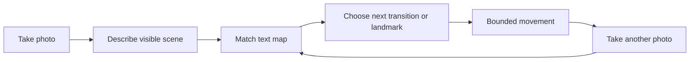

# Navigation Skill Specification

## 1. Purpose

Provide indoor navigation for a camera-equipped mobile robot using a **text-only semantic map**. The Navigation skill helps the agent:

1. estimate the robot's current location from a textual description of a newly captured camera image;
2. resolve a requested destination or point of interest;
3. plan a route through a known home; and
4. produce the next movement instruction in clear, human-style text.

The skill is designed for a known indoor environment, such as a home. It is an independent skill, not part of the robot's base hardware system.

## 2. Core Principle: Text-Only Map at Runtime

The map is Markdown text only. It does not contain or retrieve reference images at runtime.

Reference photos may be captured while setting up the home. A vision-language model uses those photos once to create or improve the Markdown descriptions. After that, runtime navigation uses only:

- the text map;
- a textual description of the current `take_photo` result; and
- the user's requested destination.

This makes the map easy to read, edit, version, and extend by hand.

## 3. Required Robot Capability

The skill requires only the base robot tools:

- `take_photo`
- `move`
- `stop`
- `get_drive_status`
- `get_robot_status`

The skill must never assume that a single image is enough to establish an exact pose. It should state confidence and request another observation or use a short, bounded observation movement when needed.

## 4. Map Files

```text
skills/navigation/
  SKILL.md
  map/
    floorplan.md
    rooms/
      living-room.md
      dining-room.md
      kitchen.md
```

### 4.1 Room Markdown

Each known room has one Markdown file. It is the canonical, text-only description of that room.

```md
# Living Room

## Identity
The living room is the room with the large grey sofa, fireplace, and armchair.

## Stable visual landmarks
- Large grey sofa against the west wall.
- Fireplace on the north wall.
- Green armchair near the south-east corner.
- Low wooden coffee table in front of the sofa.

## Sub-locations

### Between sofa and fireplace
- The sofa is close on the left or behind the robot.
- The fireplace is ahead or to the right.
- The coffee table may be directly ahead.

### At the entrance from the dining room
- The dining-room doorway is behind or beside the robot.
- The fireplace is visible ahead.

## Connections
- Dining room: doorway on the east side of the room.
- Hallway: doorway near the south-west side of the room.

## Points of interest
- Armchair: green chair near the south-east corner.
- Fireplace: north wall.
- Sofa: west wall.

## Ambiguities and cautions
- A dark room may hide the fireplace and make the room resemble the dining room.
- Do not rely on movable cushions or small objects for localization.
```

### 4.2 Floorplan Markdown

`floorplan.md` is optional but strongly recommended. It acts as a text-only topological map: a graph of rooms, transitions, and route-relevant landmarks.

```md
# Home Floorplan

## Rooms
- Living room
- Dining room
- Kitchen
- Hallway

## Direct connections
- Living room <-> Dining room: open doorway on the living room's east side.
- Dining room <-> Kitchen: doorway beside the dining table.
- Living room <-> Hallway: doorway near the sofa.

## Route hints
- From the dining-room entrance, face the open doorway to enter the living room.
- The armchair is inside the living room, near its south-east corner.

## Naming
- "The armchair" means the green armchair in the living room unless the user specifies another chair.
```

## 5. Map Creation Workflow

1. Capture several setup photos of each room, including doors, corners, major furniture, and important destinations.
2. Ask a vision-language model to turn the photos into a detailed room Markdown draft.
3. Review and correct the draft manually.
4. Add stable landmarks, room connections, sub-locations, and points of interest.
5. Create or update `floorplan.md` with direct connections and route hints.
6. Test the descriptions by asking the agent to localize from newly taken photos.

Descriptions should favor stable, large, distinctive features: doorways, wall colors, fireplaces, fixed cabinets, large furniture, and window placement. They should avoid temporary items, lighting-dependent details, and assumptions that cannot be verified from a camera image.

## 6. Runtime Localization

When the agent needs to know where it is, the skill follows this process:

1. Use `take_photo`.
2. Produce a concise factual description of what is visible.
3. Compare that description against the room Markdown files.
4. Estimate:
   - room;
   - sub-location within the room, when supported;
   - heading or likely facing direction, when supported;
   - confidence and competing hypotheses.
5. If confidence is low, take another photo after a bounded, safe observation action, such as a short turn, then compare again.

The result is always explicit about uncertainty. Example:

```text
Likely location: living room, near the dining-room entrance.
Likely heading: toward the fireplace.
Confidence: medium.
Reason: grey sofa and fireplace match the living-room map; the dining-room doorway is likely on the right.
```

## 7. Destination Resolution and Route Planning

For a request such as "go to the armchair":

1. Find the point of interest in the room Markdown files.
2. Localize the robot using the current image description.
3. If the robot is already in the destination room, select the relevant sub-location and landmark.
4. Otherwise, consult `floorplan.md` and choose a sequence of directly connected rooms.
5. Choose the next visible transition or landmark, not a long unverified motor sequence.
6. Generate one short textual instruction.
7. After executing it, take a new photo and localize again.

Example high-level plan:

```text
Current location: dining room, likely facing the living-room doorway.
Destination: green armchair in the living room.
Plan:
1. Align with the open doorway into the living room.
2. Move through the doorway.
3. Re-observe and identify the fireplace and sofa.
4. Navigate toward the south-east corner, where the armchair is described.
```

## 8. Output Contract

The skill supplies two useful outputs.

### Location result

```text
location:
  room: Living room
  sub_location: Between sofa and fireplace
  heading: Facing roughly toward fireplace
  confidence: medium
  evidence: Grey sofa, fireplace, and coffee table match the map.
  next_observation: Turn slightly right and take another photo if greater confidence is needed.
```

### Next navigation instruction

```text
Turn approximately 90 degrees to the right toward the dining-room doorway.
Move through the doorway at low speed, then stop and take another photo.
```

The instructions may be textual, but physical movement still happens only through bounded calls to `move` and `stop`.

## 9. Navigation Loop

Navigation is a repeated perceive-plan-act-verify loop:



The skill should use short segments and fresh observations. It must stop when it cannot localize with enough confidence, detects an unexpected situation, or loses the expected landmark.

## 10. Limitations

- A monocular RGB camera cannot measure exact distance or reliably detect all obstacles.
- Textual descriptions can be ambiguous, especially in visually similar rooms or changing light.
- The map can become stale when large furniture moves or rooms are rearranged.
- The skill is a semantic and topological navigator, not precise centimetre-level SLAM.
- Safe obstacle avoidance remains a separate capability and should not be claimed by this skill alone.

## 11. Design Rules

- Keep the runtime map textual and human-editable.
- Prefer room-to-room transitions and landmark verification over long open-loop routes.
- Treat the floorplan as a graph of possible transitions, not a geometric guarantee.
- State uncertainty instead of inventing a precise location.
- Ask for another observation or stop when evidence conflicts with the map.
- Keep generated route instructions short, observable, and reversible.

## 12. Future Extensions

- Add named micro-locations for more precise commands, such as "between sofa and fireplace".
- Add map-update suggestions when repeated observations contradict a room file.
- Add optional depth, wheel odometry, or other sensors without changing the text-map interface.
- Add a visual overview of the text floorplan in the web UI while preserving Markdown as the source of truth.
