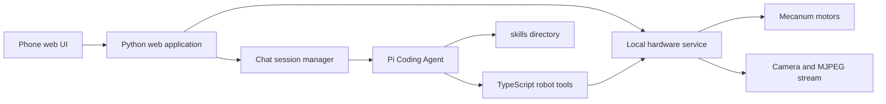

# Robot Agent Specification

## 1. Purpose

Build a small, friendly, mobile home robot based on a Raspberry Pi Zero 2 W. The robot uses four Mecanum wheels and an RGB camera. It is controlled from a phone-first web application and is operated by a Pi Coding Agent that can use robot tools, reason about camera images, and create or extend skills.

The system should be easy to understand, operate, and modify. It should support generative, non-deterministic agent behavior while keeping direct hardware access reliable and bounded.

## 2. Scope

### Included in the first version

- Existing four-wheel Mecanum drive and manual web control.
- Camera live stream in the web interface.
- A redesigned portrait-oriented mobile cockpit with chat.
- Pi Coding Agent integration through TypeScript tools.
- A small, explicit set of robot tools.
- Web chat sessions, new-chat support, and context compaction.
- A `skills/` directory for bundled, user-provided, and later agent-created skills.


## 3. Existing Hardware Service

The existing Navibot web service is the sole owner of GPIO, motor drivers, and camera access. It already provides:

- Four-motor Mecanum drive, including forward/reverse, rotation, strafing, and vector mixing.
- A motor safety watchdog that stops motion when commands are no longer refreshed.
- A Picamera2 MJPEG live stream.
- Mobile manual controls and a stop endpoint.

The agent must not access GPIO or the camera directly. It talks to the existing local hardware service through a narrow local API. This prevents competing processes from controlling the same hardware.

## 4. Architecture



### Responsibilities

| Component | Responsibility |
|---|---|
| Python web application | Mobile UI, live stream embedding, manual control, chat transport, session history. |
| Hardware service | GPIO, motors, camera, safety watchdog, local robot API. |
| Pi Coding Agent | Natural-language interaction, planning, tool use, and skill work. |
| TypeScript extension | Registers robot tools for the Pi Coding Agent and calls the local hardware API. |
| Skills directory | Holds reusable skills. The Memory skill will be added later. |

## 5. Mobile Web Interface

The primary experience is a phone held in portrait orientation.

### Layout

1. **Header:** connection state, compact battery/state indicators when available, and an always-visible emergency stop.
2. **Top:** compact live camera image. It should be useful for orientation without consuming the page.
3. **Middle:** the main chat area. It shows user messages, robot replies, concise action progress, and optional skill-related cards.
4. **Bottom:** manual drive controls within thumb reach.

### Manual controls

- A central joystick for forward, reverse, diagonal movement, and turning.
- Large hold-to-drive strafe buttons on the left and right of the joystick.
- Releasing a control immediately sends stop.
- Manual control and emergency stop have priority over agent-driven motion.

The web server owns camera streaming. The live image is not an agent tool.

## 6. Agent Tools

The first tool surface stays intentionally small.

| Tool | Purpose |
|---|---|
| `move` | Drive with a bounded direction/vector, speed, and duration. Internally refreshes the hardware safety deadline and always stops at completion. |
| `stop` | Immediately stop all motion. |
| `get_drive_status` | Read the current drive state and active safety deadline. |
| `take_photo` | Return a single current camera frame for the agent to inspect. |
| `get_robot_status` | Read available robot health data, such as camera state and system status. |

`take_photo` should use an atomic snapshot of the camera service's latest frame. The agent can analyze that returned image directly; a separate image-analysis tool is not needed.

No skill-management tools are required. Pi can work with skills through its normal skill and file mechanisms.

## 7. Motion Safety

Generative behavior is desired, but low-level motion must remain bounded.

- Every `move` call requires a finite duration and capped speed.
- The tool must guarantee a final stop, including on error.
- The existing hardware watchdog remains active as an independent fallback.
- The emergency stop always overrides all other actions.
- The local robot API must not be exposed without a trusted-network boundary or authentication.

These limits protect the physical platform; they do not prescribe how the agent reasons, plans, or creates skills.

## 8. Pi Coding Agent

Reuse the Pi Coding Agent architecture from `pi.lot`.

- Run Pi with its existing RPC/session model.
- Register robot tools as a TypeScript Pi extension.
- Keep agent workspace data and user skills persistent.
- Load user-provided skills from the project `skills/` directory.
- Put robot identity, environment, and behavioral context in `AGENTS.md`.

### AGENTS.md responsibilities

The agent context should state that the robot is:

- Friendly and helpful.
- Approximately 30 by 30 cm.
- Operating on the floor in a home.
- Careful around uncertainty and physical movement.
- Able to learn and extend skills over time.
- Required to use the provided robot tools for physical actions.
- the mecanum wheels have a diameter of around 6cm (this information can be used by the agent for trajectory planning)

## 9. Skills

Use a simple `skills/` directory as the extension point:

```text
skills/
  memory/          # added later; already prepared by the user
  follow_me/       # future example
  head_shake/      # future example: a left-right Mecanum gesture
```

Skills may be preloaded by the user or later created and improved by the agent. A skill owns its own instructions, implementation, and any internal data. The Memory skill owns memory storage and retrieval, so these are not base robot tools.

## 10. Web Chat and Sessions

The web interface replaces the Telegram front end used by the existing Pi project.

- Each web conversation maps to one Pi agent session.
- The UI provides a **New chat** control; `/new` in the chat can perform the same action.
- Chat history is stored and remains readable in the UI.
- The agent session is compacted automatically before its provider/model context limit is reached.
- Compaction preserves a concise operational summary: user goals, robot state, important decisions, active tasks, and relevant skills.
- The compaction threshold must be configurable and model-aware, rather than hard-coded to a single token number.

## 11. Configuration

Provider-specific values are loaded at startup from a local `.env` file. The code should not need changes when switching provider or model.

Example categories of configuration:

- AI provider and model.
- API key or compatible local endpoint.
- Agent workspace and skills path.
- Hardware service base URL.
- Session compaction threshold.
- Motion speed and duration limits.

Secrets must not be committed to version control.

## 12. Initial Implementation Order

1. Preserve the existing hardware service and validate its local control API.
2. Add snapshot, drive-status, and robot-status endpoints where needed.
3. Create the TypeScript Pi extension with the five base robot tools.
4. Add `AGENTS.md`, `.env` loading, and the `skills/` directory.
5. Rebuild the web UI as the portrait mobile cockpit.
6. Add web-to-Pi chat transport, session creation, `/new`, history, and compaction.
7. Add the finished Memory skill.
8. Add autonomous skills only after the platform and interaction loop are stable.

